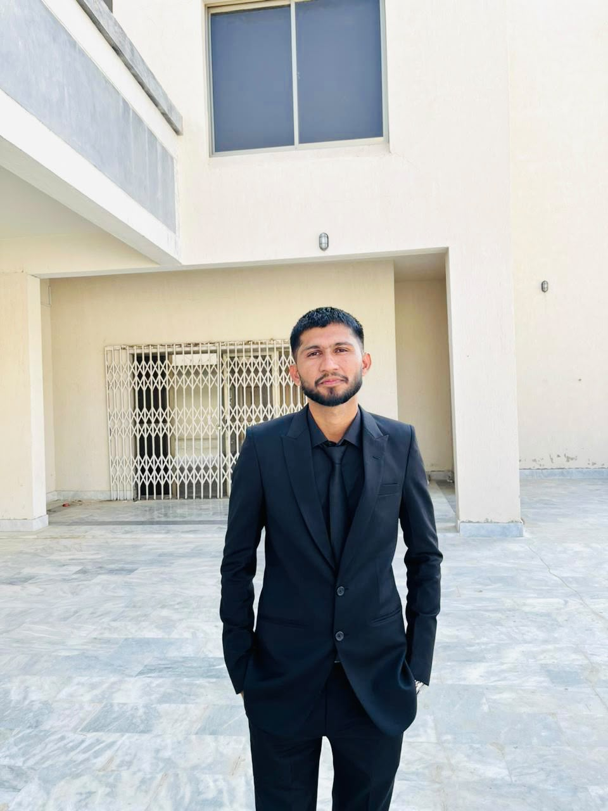

<div align="center">

# Abdul Razzaq

### Software Engineer • AI/ML Engineer 

<!--  -->

<br>


</div>

---

```text
                     Abdul Razzaq

OS          : Windows 11 
Location    : Karachi, Pakistan 🇵🇰
Education   : B.E Software Engineering
University  : Mehran University
Role        : AI Engineer

Languages   : Python, JavaScript, MySQL

Libraries    : NumPy, Pandas, Matplotlib, Seaborn, Streamlit, OpenCv, SpaCy, NLTK

Backend     : FastAPI

AI          : LangChain
              LangGraph
              Ollama
              Groq
              OpenAI
              Gemini
              Pinecone
              ChromaDB

Automation  : n8n
              

Database    : MySQL
              SQLite
              Supabase
              VectorDB

Cloud       : Vercel
              AWS

Tools       : Git
              Docker
              VS Code
              Postman
              

Currently   : Building AI Agents
```

---

# About Me

```yaml
Name: Abdul Razzaq

Role:
  AI Engineer

Experience:
  AI Engineer @ Calon AI Solutions
  AI/ML Intern @ ITSOLERA PVT LIMITED

Interests:
  - AI Agents
  - LLMs
  - Automation
  - RAG Systems
  - ML & DL
  - GenAI

Currently Learning:
  - Playwright
  - SQA
  - Software Testing
  - Advanced LangGraph
  - Advance Agentic AI
```

---

## Tech Stack

<p align="center">


</p>

---

## GitHub Stats

<p align="center">


</p>

---

## Languages

<p align="center">


</p>

---

## Activity Graph


---

## Connect with Me

<p align="center">

<a href="https://www.linkedin.com/in/abdulrazzaq039/">

</a>

<a href="mailto:abdul.razzaq39390@gmail.com">

</a>


</p>

---

## Visitor Count


---

## Quote

> "Turning ideas into intelligent products through AI."
